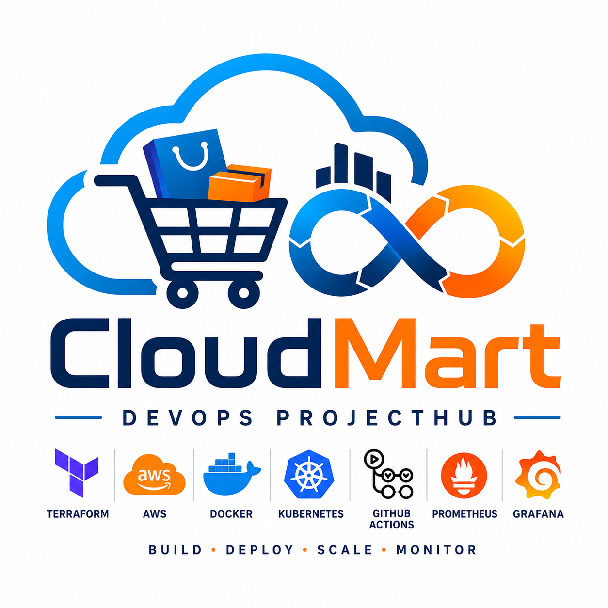

<p align="center">
  
</p>

<h1 align="center">🚀 CloudMart DevOps ProjectHub</h1>

<p align="center">
A production-inspired DevOps project using AWS, Terraform, Docker, Kubernetes, GitHub Actions, and Monitoring.
</p>
 🚀 DevOps ProjectHub – CloudMart Deployment

 A production-inspired DevOps project demonstrating the deployment of a containerized full-stack e-commerce application on AWS using Terraform, Docker, Kubernetes (Amazon EKS), GitHub Actions, and modern monitoring tools.

---

## 📖 Overview

DevOps ProjectHub showcases how to provision cloud infrastructure, containerize applications, automate deployments, and monitor workloads using industry-standard DevOps tools.

This project follows Infrastructure as Code (IaC) principles and implements a complete CI/CD pipeline for deploying a scalable application on AWS.

---

## ✨ Features

- 🏗 Infrastructure as Code using Terraform
- ☁️ AWS Cloud Deployment
- 🐳 Dockerized Frontend & Backend
- ☸ Amazon EKS Kubernetes Cluster
- 🔄 GitHub Actions CI/CD Pipeline
- 📦 Amazon ECR Container Registry
- 🛡 Secure Networking with VPC & Security Groups
- 🗄 Amazon RDS Database
- 📊 Monitoring with Prometheus & Grafana
- 📈 CloudWatch Metrics
- 🌐 Kubernetes Ingress
- 🔐 Kubernetes Secrets & ConfigMaps
- 🚀 Automated Deployment Scripts

---

# 🛠 Tech Stack

| Category | Technologies |
|----------|--------------|
| Cloud | AWS |
| IaC | Terraform |
| Containerization | Docker |
| Orchestration | Kubernetes (Amazon EKS) |
| CI/CD | GitHub Actions |
| Registry | Amazon ECR |
| Database | Amazon RDS |
| Monitoring | Prometheus, Grafana, CloudWatch |
| Backend | Node.js, Express |
| Frontend | React, Vite |
| Reverse Proxy | NGINX |

---

# 📂 Project Structure

```text
devops-projecthub/
│
├── backend/
├── frontend/
├── terraform/
├── infrastructure/
├── k8s/
├── monitoring/
│   ├── cloudwatch-agent/
│   ├── prometheus/
│   └── grafana/
│
├── docs/
├── scripts/
├── nginx/
├── .github/
│   └── workflows/
│
├── docker-compose.yml
├── README.md
└── .gitignore
```

---

# ☁ AWS Architecture

```
                    GitHub
                       │
                GitHub Actions
                       │
              Build Docker Images
                       │
                Push to Amazon ECR
                       │
                 Amazon EKS Cluster
                       │
            Kubernetes Deployments
                       │
        ┌──────────────┴──────────────┐
        │                             │
   Frontend Service             Backend Service
        │                             │
        └──────────────┬──────────────┘
                       │
                  Amazon RDS
                       │
                CloudWatch Logs
                       │
             Prometheus + Grafana
```

---

# 📦 Infrastructure

The project provisions AWS infrastructure using Terraform.

Resources include:

- Amazon VPC
- Public & Private Subnets
- Internet Gateway
- NAT Gateway
- Route Tables
- Security Groups
- Amazon EKS
- Managed Node Groups
- Amazon ECR
- Amazon RDS
- IAM Roles & Policies

---

# ☸ Kubernetes Components

- Namespace
- Deployments
- Services
- ConfigMaps
- Secrets
- Ingress
- Rolling Updates

---

# 🔄 CI/CD Pipeline

GitHub Actions automatically:

- Checkout Source Code
- Build Docker Images
- Push Images to Amazon ECR
- Update Kubernetes Deployment
- Perform Rolling Updates

---

# 📊 Monitoring

Monitoring stack includes:

- Amazon CloudWatch
- Prometheus
- Grafana Dashboard

Metrics:

- CPU Usage
- Memory Usage
- Running Pods
- Node Status
- Network Traffic

---

# 🚀 Getting Started

## Clone Repository

```bash
git clone https://github.com/Tushar997581/devops-projecthub.git

cd devops-projecthub
```

---

## Configure AWS

```bash
aws configure
```

---

## Terraform

```bash
cd terraform

terraform init

terraform plan

terraform apply
```

---

## Configure kubectl

```bash
aws eks update-kubeconfig \
--region ap-south-1 \
--name cloudmart-eks
```

---

## Deploy Kubernetes

```bash
kubectl apply -f k8s/
```

---

## Verify Deployment

```bash
kubectl get pods -A

kubectl get svc -A

kubectl get ingress -A
```

---

# 📷 Screenshots

Add screenshots after deployment.

```
docs/screenshots/

terraform-apply.png

eks-cluster.png

pods-running.png

frontend.png

grafana-dashboard.png

cloudwatch.png
```

---

# 📚 Documentation

Additional documentation is available in:

```
docs/

architecture.md

deployment.md

troubleshooting.md
```

---

# 📈 Future Improvements

- Helm Charts
- ArgoCD GitOps
- Horizontal Pod Autoscaler
- AWS WAF
- Service Mesh (Istio)
- Multi-Environment Deployments
- Blue/Green Deployments
- Canary Releases

---

# 🤝 Contributing

Contributions, issues, and feature requests are welcome.

Feel free to fork the repository and submit a Pull Request.

---

# 👨‍💻 Author

**Tushar Jadhav**

GitHub:
https://github.com/Tushar997581

---

# ⭐ Support

If you found this project helpful, consider giving it a ⭐ on GitHub.

---

## 📄 License

This project is licensed under the MIT License.